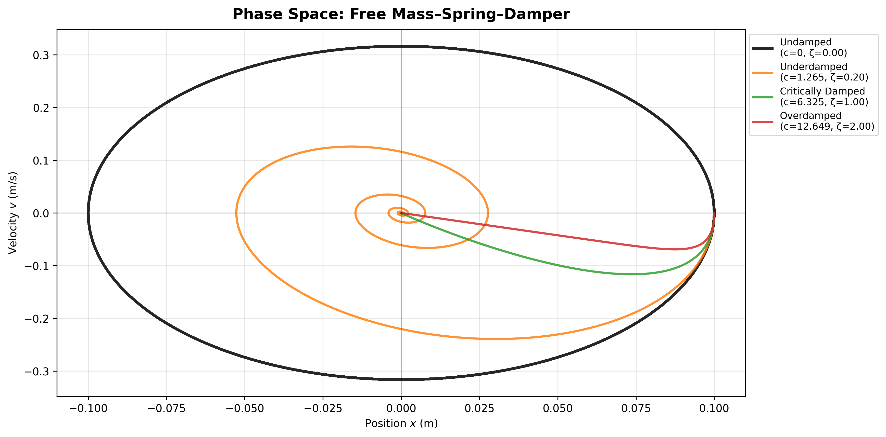
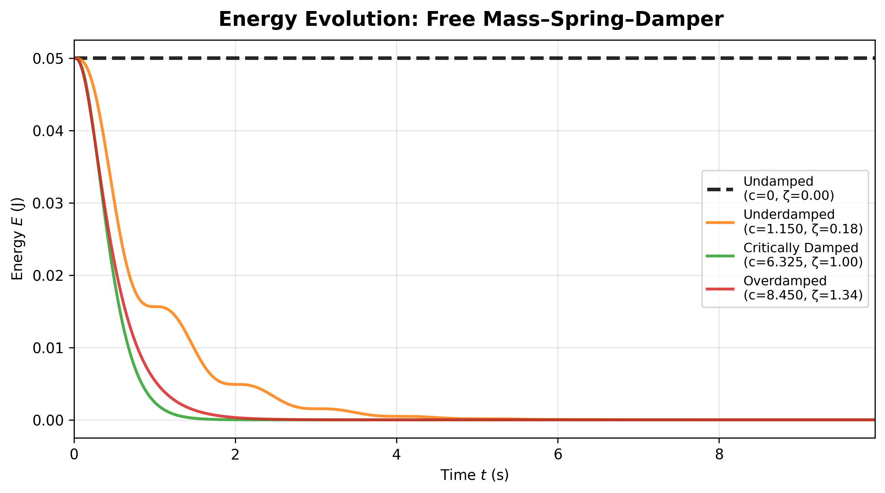
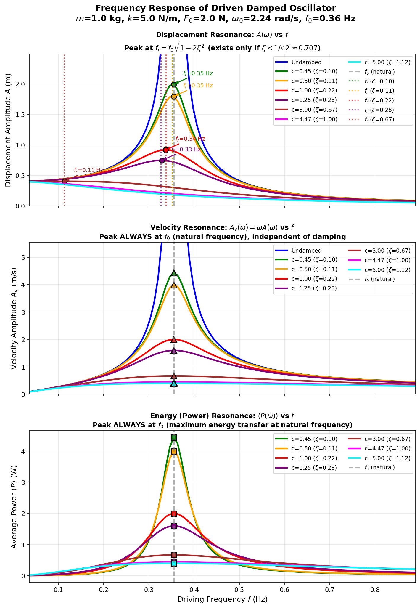

# Simple Harmonic Motion: Interactive Physics Simulations

[](https://www.python.org/)
[](https://jupyter.org/)
[](LICENSE)
[](https://matplotlib.org/)

A comprehensive Python-based interactive study of **Simple Harmonic Motion (SHM)** featuring advanced visualizations, exact analytical solutions, and numerical simulations using the Runge-Kutta 4th order method.


## 📋 Table of Contents
- [Overview](#overview)
- [Features](#features)
- [Demo](#demo)
- [Installation](#installation)
- [Usage](#usage)
- [Project Structure](#project-structure)
- [Mathematical Background](#mathematical-background)
- [Examples](#examples)
- [License](#license)


---

## 🎯 Overview


- **Systems**: simple pendulum (small-angle SHM and large-amplitude motion with exact periods via elliptic integrals) and mass–spring–damper (undamped, underdamped, critically damped, overdamped, and driven).
- **Methods**: analytical results where available; 4th‑order Runge–Kutta (RK4) for general damped/forced dynamics.
- **Visuals**: time‑series, phase‑space (x, v), and energy diagnostics to interpret conservative motion, damped decay, and driven steady state.
- **Resonance**: displacement peaks at $f_r=f_0\sqrt{1-2\zeta^2}$ (if $\zeta<1/\sqrt{2}$); velocity and power peak at $f_0$.


| **Damped Pendulum** | **Mass-Spring-Damper** |
|---|---|
|  |  |

---

## ✨ Features

### 🎨 Advanced Visualizations
- **Real-time animations** with customizable parameters
- **Phase space diagrams** showing velocity vs position trajectories
- **Energy plots** demonstrating conservation and dissipation
- **Multi-system comparisons** with side-by-side animations

### 🔬 Rigorous Physics
- **Exact period calculation** using complete elliptic integrals for large-amplitude pendulum motion
- **Nonlinear dynamics** simulation without small-angle approximation
- **Energy analysis** tracking kinetic, potential, and total energy
- **Resonance behavior** under sinusoidal forcing

### 🧮 Numerical Methods
- **4th-order Runge-Kutta (RK4)** solver for accurate time evolution
- **Adaptive time stepping** for efficient computation
- **High-precision results** with global error O(h⁴)

### 🎛️ Interactive Controls
- Adjustable physical parameters (mass, length, damping coefficient, spring constant)
- Customizable initial conditions (displacement, velocity, angle)
- Variable simulation duration and frame rate
- Animation export to GIF format

---

## 🎬 Demo

### Pendulum Motion

#### Undamped Pendulum with Large Amplitude


#### Damped vs Undamped Comparison


### Mass-Spring-Damper System

#### Multiple Damping Regimes


#### Complete System Analysis


#### Phase Space Trajectories



---

## 🚀 Installation

### Prerequisites

- Python 3.8 or higher
- pip package manager

### Clone the Repository

```bash
git clone https://github.com/PuspenduPH/SimpleHarmonicMotion-Simulation.git
cd SimpleHarmonicMotion-Simulation
```

### Install Dependencies

```bash
pip install -r requirements.txt
```

Or install packages individually:

```bash
pip install numpy matplotlib scipy jupyter
```

---

## 📖 Usage

### Quick Start

1. **Open the Jupyter Notebook:**
   ```bash
   jupyter notebook shm.ipynb
   ```

2. **Run all cells** sequentially to define all functions

3. **Execute animation functions** to see the simulations

### Basic Examples

#### Animate a Simple Pendulum

```python
# Animate an undamped pendulum
animation = animate_pendulum(
    L=1.0,              # Pendulum length (m)
    G=9.81,             # Gravity (m/s²)
    theta_0_deg=30.0,   # Initial angle (degrees)
    num_revolutions=5,  # Number of oscillations
    fps=30,             # Frame rate
    save_animation=False
)
```

#### Compare Different Damping Cases

```python
# Animate multiple damping regimes
animation = animate_multiple_damping_cases(
    m=1.0,                          # Mass (kg)
    c_values=[0, 0.5, 6.32, 10],   # Damping coefficients
    k=10.0,                         # Spring constant (N/m)
    A=0.1,                          # Amplitude (m)
    oscillations=5.0,               # Duration
    fps=30
)
```

#### Full Analysis with Plots

```python
# Complete visualization with real-time plots
animation = animate_multiple_damping_cases_with_plots(
    m=1.0,
    c_values=[0, 2.0, 6.32],
    k=10.0,
    A=0.1,
    oscillations=5.0,
    save_animation=True,
    filename="complete_analysis.gif"
)
```

### Advanced Usage

#### Custom Forcing Functions

```python
# Apply sinusoidal forcing
def my_forcing(t):
    return 2.0 * np.sin(2 * np.pi * t)

animation = animate_mass_spring_shm(
    m=1.0, c=0.5, k=10.0,
    forcing_func=my_forcing,
    oscillations=10
)
```

#### Calculate Exact Pendulum Period

```python
# For large amplitude (90 degrees)
theta_max = np.radians(90)
L = 1.0
g = 9.81

# Small angle approximation
T_small = 2 * np.pi * np.sqrt(L / g)

# Exact period using elliptic integral
T_exact = calculate_nonlinear_period(theta_max, L, g)

print(f"Small angle period: {T_small:.4f} s")
print(f"Exact period: {T_exact:.4f} s")
print(f"Difference: {(T_exact/T_small - 1)*100:.2f}%")
```

---

## 📁 Project Structure

```
simple-harmonic-motion/
├── shm.ipynb                  # Main Jupyter notebook
├── README.md                  # This file
├── requirements.txt           # Python dependencies
├── LICENSE                    # License file
└── OUTPUTS/                   # Generated animations
    └── ANIMATIONS/
        ├── pendulum/
        └── mass_spring/
    └── PLOTS/
        ├── energy_plots/
        └── phase_space/
```

---

## 🧮 Mathematical Background

### Pendulum Motion

For a simple pendulum, the equation of motion is:

$$\frac{d^2\theta}{dt^2} + \frac{g}{L}\sin\theta = 0$$

For large amplitudes, the period is given by:

$$T = 4\sqrt{\frac{L}{g}} \, K\left(\sin^2\frac{\theta_0}{2}\right)$$

where $K(k)$ is the complete elliptic integral of the first kind.

With damping:

$$\frac{d^2\theta}{dt^2} + \gamma\frac{d\theta}{dt} + \frac{g}{L}\sin\theta = 0$$

### Mass-Spring-Damper System

The equation of motion is:

$$m\ddot{x} + c\dot{x} + kx = F(t)$$

In standard form:

$$\ddot{x} + 2\zeta\omega_n\dot{x} + \omega_n^2 x = \frac{F(t)}{m}$$

where:
- $\omega_n = \sqrt{k/m}$ is the natural frequency
- $\zeta = c/(2\sqrt{km})$ is the damping ratio

#### Damping Regimes

| Regime | Condition | Behavior |
|--------|-----------|----------|
| **Undamped** | $\zeta = 0$ | Pure harmonic oscillation |
| **Underdamped** | $0 < \zeta < 1$ | Oscillatory with exponential decay |
| **Critically Damped** | $\zeta = 1$ | Fastest return without overshoot |
| **Overdamped** | $\zeta > 1$ | Slow, non-oscillatory return |


### Runge-Kutta 4th Order Method

The RK4 method approximates the solution to:

$$\frac{dy}{dt} = f(t, y)$$

using:

$$y_{n+1} = y_n + \frac{h}{6}(k_1 + 2k_2 + 2k_3 + k_4)$$

where:
- $k_1 = f(t_n, y_n)$
- $k_2 = f(t_n + h/2, y_n + hk_1/2)$
- $k_3 = f(t_n + h/2, y_n + hk_2/2)$
- $k_4 = f(t_n + h, y_n + hk_3)$

This provides **4th-order accuracy** with global error $O(h^4)$.

---

## 💡 Examples

### Example 1: Period vs Amplitude for Pendulum

```python
import numpy as np
import matplotlib.pyplot as plt

L = 1.0
g = 9.81
angles = np.linspace(0, np.pi*0.99, 100)

periods = [calculate_nonlinear_period(theta, L, g) for theta in angles]
T_0 = 2 * np.pi * np.sqrt(L / g)

plt.plot(np.degrees(angles), np.array(periods) / T_0)
plt.xlabel('Initial Angle (degrees)')
plt.ylabel('Period Ratio (T/T₀)')
plt.title('Pendulum Period vs Initial Amplitude')
plt.grid(True)
plt.show()
```


### Example 2: Energy Dissipation in Damped System



### Example 3: Resonance Phenomenon




### Example 4: Phase Space and Energy Analysis


---

## 🎓 Educational Applications

This project is ideal for:

- **Physics Education**: Visualizing fundamental concepts in classical mechanics
- **Numerical Methods**: Learning RK4 and other integration techniques
- **Engineering**: Understanding damping in mechanical systems
- **Research**: Analyzing nonlinear oscillatory systems
- **Self-Study**: Interactive exploration of SHM phenomena

---

## 🔬 Key Concepts Demonstrated

1. **Nonlinear Dynamics**: Exact treatment without small-angle approximation
2. **Energy Conservation**: Tracking energy in conservative and dissipative systems
3. **Phase Space Analysis**: Understanding system behavior through trajectories
4. **Damping Effects**: Comparing different dissipation regimes
5. **Numerical Integration**: High-accuracy ODE solving with RK4
6. **Special Functions**: Application of elliptic integrals in physics

---

## 📄 License

This project is licensed under the MIT License - see the [LICENSE](LICENSE) file for details.

---

**Made with ❤️ and Python**
